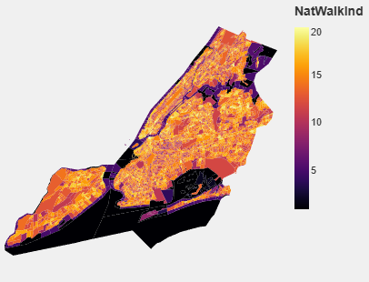
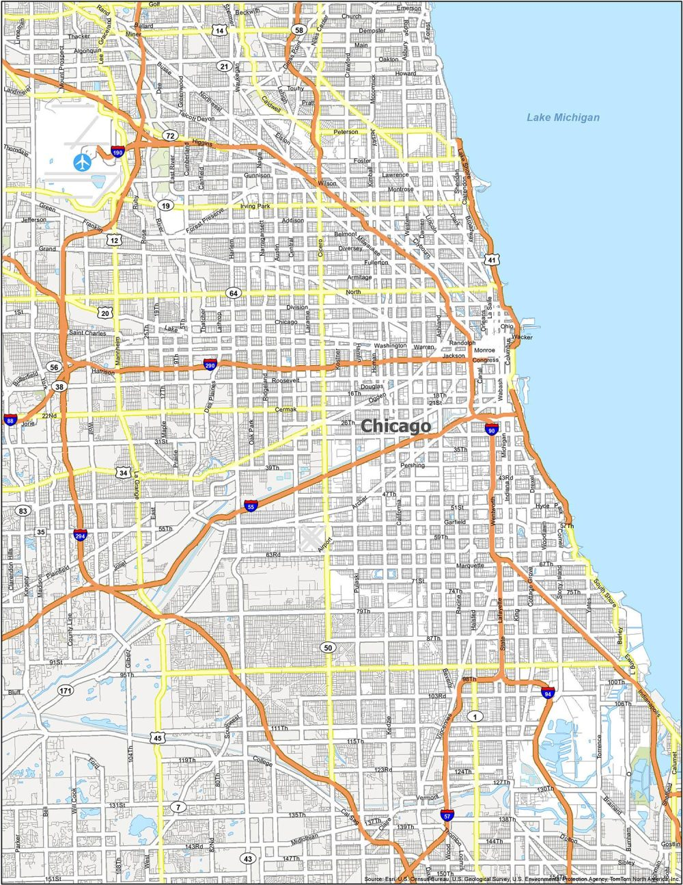

#### How many people live in walkable areas?

Type: bar chart
This shows the population distributed over the EPA National Walkability Index (NPI) scores in each of the metro areas. This chart gives a broad overview of how many people live in more walkable areas in each city, while also visually preserving the difference in population between CBSAs.

Type: line graph (density function)
These density graphs should be displayed with or possibly overlaid on the previous bar chart; for each city, they show a density function of population over the NWI score range. This more clearly shows differences in distribution between the CBSAs - the shape of the distributions for Houston and Dallas are notably different from those for New York and LA, for example.

Type: stacked bar chart
This shows a direct comparison of the proportion of each city's population living in walkable areas.

#### Walkable areas vote blue (or, blue areas are more walkable)

Type: scatter plot
This shows NWI score vs percentage 2020 Democratic lead for each county in the five CBSAs, color-coded by metro area. This shows a clear linear relationship between the two: more walkable counties are more Democratic. This isn't intended to suggest a causal relationship between the two, but I think the strength of the relationship is an interesting part of the story.

Type: map (geo_shape)
These two maps side-by-side present a comparison between walkability index (at block group level) and 2020 voting (at precinct level) in the Dallas metro area. The relationship between the two is particularly clear here, since you can see pockets of brighter (more walkable) areas on the walkability map corresponding to pockets of blue on the voting map.

#### I'm walking here: car ownership is lower in New York

Type: bar chart
This shows the proportion of households in each metro area which own zero, one or two or more cars; the New York area is a notable exception. Even though the distribution of people living in walkable areas in New York and LA are similar, car ownership patterns are very different. (I hope to display this somewhat differently in the final version to highlight New York as an outlier.)

Type: map, pie chart (!)
These charts focus specifically on the five boroughs of New York City, making a connection between the high walkability scores of the boroughs and low car ownership.

Type: heatmap
This shows a heatmap of car ownership by NWI score for all CBSAs.

#### Wealth and walkability in Chicago

Type: map
These three maps of Cook County show walkability, 2020 voting patterns and the percentage of households categorized as low-wage by block group. Together, they show a political and economic divide between the more walkable, wealthier north side of the city and the less walkable south side.

#### Transit patterns

Type: map
These map shows the number of jobs within a 45-minute commute by car and by transit respectively in Cook County. This illustrates how well different parts of the city are connected to the economic center of Chicago. Road and rail maps are provided for context.
